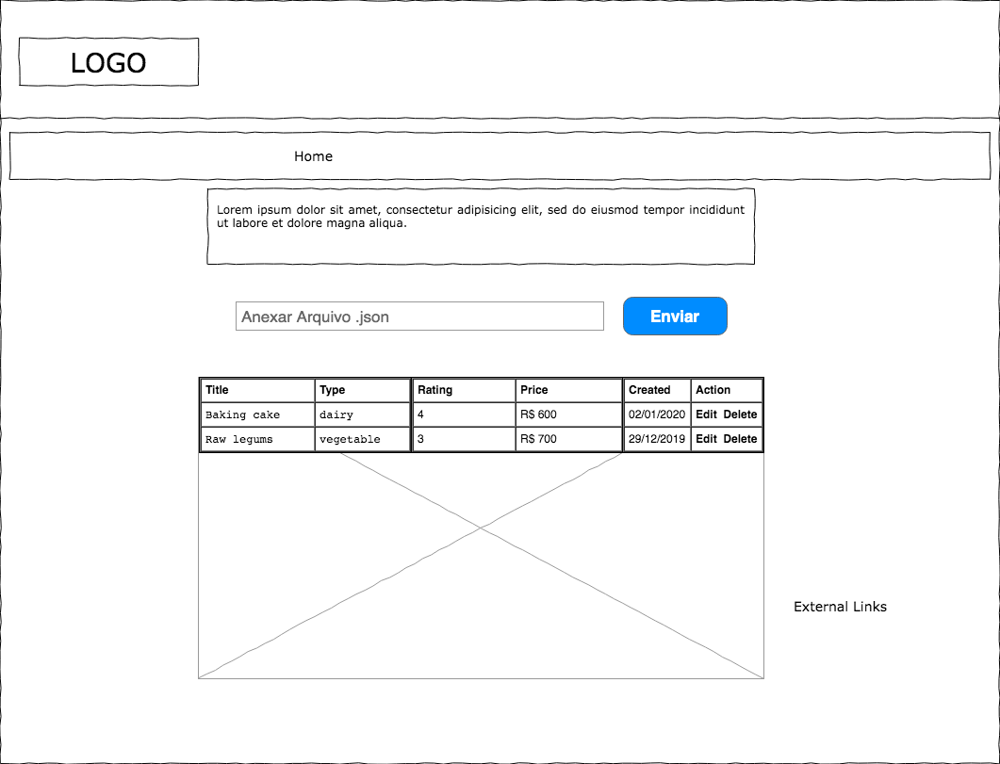

# PHP Challenge 20201117
### Made with:

PHP / Laravel / VueJS / Vue Material / MySQL

### Description

Project to upload a JSON file to register products in database. 
This project is separete in two modules:
 - api: REST API made for handle the upload and CRUD of produts (To process the JSON file, is used laravel queue)
 - web: Frontend to consume the REST API

## Installation

You just need docker and docker compose

```console
git clone https://lab.coodesh.com/filipborgs48/php-challenge-20201117.git
cd php-challenge-20201117
cp api/.env.example api/.env
docker-compose up -d
docker exec desafio-php-fb composer install
sudo chmod 777 -R api/public api/bootstrap api/storage
docker exec desafio-php-fb php artisan key:generate
docker exec desafio-php-fb php artisan queue:work

```

The API base url is http://localhost:8000/api/v1
The Frontend base url is http://localhost:8089

## Documentation

The security method of the endpoints is API KEY, send in the header of request:

```
headers: {
    'key': 'qNBC!GvgpFHJNVLmD7su'
}
```
More information in: 
https://app.swaggerhub.com/apis/filipborgs/php-challenge-20201117/v1
--------------------------------------------------------

# Challenge
### Obrigatório
 
- Leia atentamente todo o descritivo desse documento antes de qualquer coisa;
- Trabalhar em um FORK deste repositório em seu usuário;
- O projeto Web deve utilizar Vue.js;
- O projeto back-end deverá ser desenvolvido em PHP, preferência usando Laravel ou Symphony;
- O Front-End deve utilizar [Bootstrap](https://getbootstrap.com/) ou [Vue Material](https://vuematerial.io/);
- Utilize sempre boas práticas nas implementações: OOP, SOLID, DDD e Clean Code.


## Back-End
 
### Banco de Dados
 
- Criar um banco de dados MySQL no Heroku: https://elements.heroku.com/addons/jawsdb
- Utilize Migrations
- Utilize Repository Pattern

### Endpoints

- Criar uma REST API usando PHP com os seguintes endpoints:
     
    `GET /`: Retornar um Status: 200 e uma Mensagem "PHP Challenge 20201117"
    
    `POST /products`: O endpoint irá processar o arquivo [products.json](products.json) que será enviado pelo Projeto Web
    
    `PUT /products/:productId`: Será responsável por receber atualizações realizadas no Projeto Web
    
    `DELETE /products/:productId`: Remover o produto da base
    
    `GET /products/:productId`: Obter a informação somente de um produto da base de dados

    `GET /products`: Listar todos os produtos da base de dados

- Integrar a API com o banco de dados MySQL criado no Heroku para persistir os dados
- Até o momento, os Endpoints estão todos abertos para acesso. Isso não é legal a nível de segurança, dessa forma, queremos que você use um esquema para bloquear qualquer tipo de acesso, configurando
uma **API Key** para que somente possa acessar os Endpoints, "Requests" autorizadas;

> Dica: Talvez o endpoint da Home precise ser público.

### Documentação

Escrever a documentação da API utlizando conceito [OpenAPI Specification](https://github.com/OAI/OpenAPI-Specification) em versões superiores ao v2.0

### Extras

- **Diferencial 1 -** Escrever um fluxo em background para processar o upload de produtos usando [Queue](https://www.php.net/manual/es/class.ds-queue.php) 
- **Diferencial 2 -** Escrever Unit Test utilizando [PHPUnit](https://phpunit.de/)
- **Diferencial 3 -** Executar o projeto usando Docker
- **Diferencial 4 -** Escrever o esquema de segurança aplicado nos endpoints 
 
## Front-End
 


### Upload de produtos
 
Seu objetivo é montar uma tela para a equipe de produtos importar os arquivos JSON gerados pelo sistema de manufatura da empresa ao novo Dashboard. 
Nesta tela devemos adicionar um campo do tipo File que somente permite arquivos .json e tem faça a validação dos arquivos anexados antes de serem enviados a REST API. 

Somente arquivos válidos podem ser enviados ao Dashboard. 

O Product Manager do projeto deixou uma sugestão de mockup acima.

> Recomendado adicionar alertas de validações em cada passo

 
### Listar produtos
 
Criar uma sessão na tela com uma tabela para listar os produtos processados pela API. É importante ter os seguintes campos:
 
        - Title
        - Type
        - Rating
        - Price
        - Created (Data do upload do produto a nova base de datos)
        - Actions (Botões Editar e Excluir)
 
### Editar produto
 
Na tabela com os produtos precisamos disponibilizar os formulários com todos os campos dos produtos para que a equipe possa editá-los. 
Fazer validação de alguns campos obrigatórios:

        - Title
        - Type
        - Price
 
### Remover produto
 
Antes de completar a ação de remover produto, devemos perguntar ao usuário se ele realmente 
quer realizar a ação. Para evitar a remoção de produtos de maneira indesejada. 

Após remover com êxito, notificar o usuário com um alerta de sucesso. 

### Extras

- **Diferencial 1** - Escrever Unit Test para validar o fluxo a renderização de elementos do Front End
- **Diferencial 2** - Escrever Unit Test para validar os fluxos de Editar e Remover produtos;
 
## Readme do Repositório
 
- Deve conter o título de cada projeto
- Uma descrição de uma frase
- Como instalar e usar o projeto (instruções)
- Não esqueça o [.gitignore](https://www.toptal.com/developers/gitignore)
 
## Finalização 

Avisar sobre a finalização e enviar para correção em: [https://coodesh.com/review-challenge](https://coodesh.com/review-challenge) 
Após essa etapa será marcado a apresentação/correção do projeto.

## Instruções para a Apresentação: 

1. Será necessário compartilhar a tela durante a vídeo chamada;
2. Deixe todos os projetos de solução previamente abertos em seu computador antes de iniciar a chamada;
3. Deixe os ambientes configurados e prontos para rodar; 
4. Prepara-se pois você será questionado sobre cada etapa e decisão do Challenge;
5. Prepare uma lista de perguntas, dúvidas, sugestões de melhorias e feedbacks (caso tenha).


## Suporte

Use o nosso canal no slack: http://bit.ly/32CuOMy para tirar dúvidas sobre o processo ou envie um e-mail para contato@coodesh.com. 
